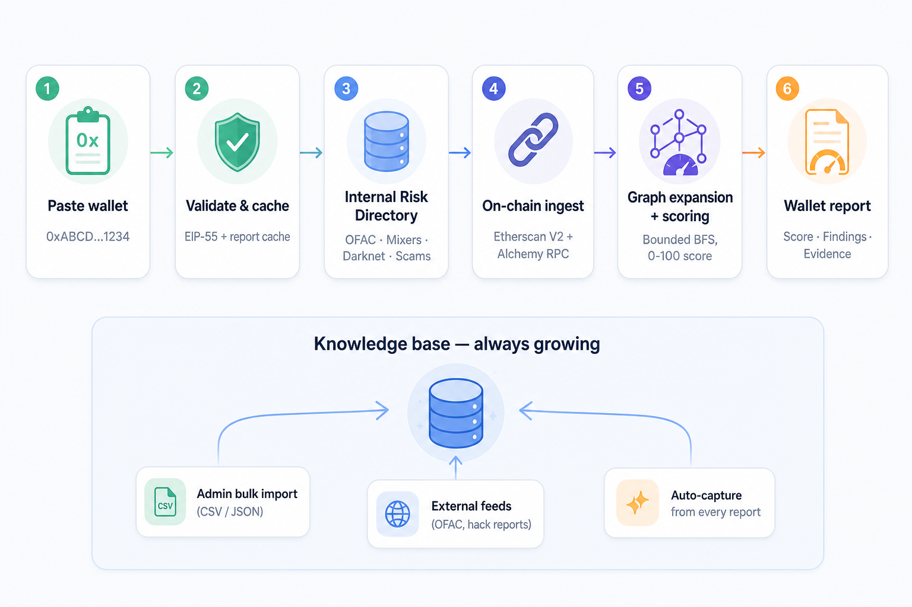
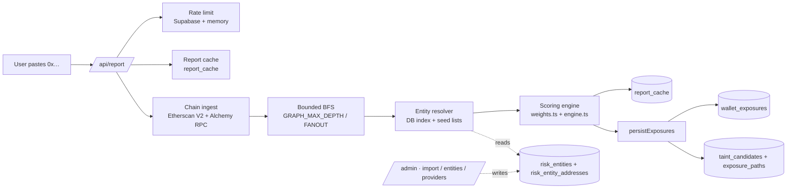
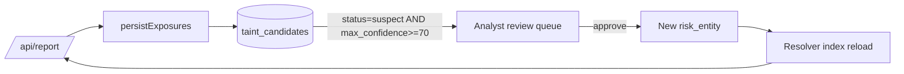

# Engine, internal DB, auto-detection / Движок, внутренняя БД и автодетекция

Companion to [`README.md`](README.md), [`METHODOLOGY.md`](METHODOLOGY.md) and
[`ROADMAP.en.md`](ROADMAP.en.md) / [`ROADMAP.ru.md`](ROADMAP.ru.md). Документ объясняет, **как именно работает наш
risk-engine**, **из чего состоит наша внутренняя база**, **как она пополняется
сейчас** и **как мы автоматически отлавливаем подозрительные кошельки** —
плюс план того, как этот цикл сделать непрерывным.

---

## 1. Architecture at a glance / Архитектура в одном экране



---

## 2. The user journey / Что видит пользователь

С точки зрения человека, который зашёл на сайт, всё выглядит как одно
поле «вставь адрес → получи отчёт». Под капотом в этот момент случается
шесть последовательных шагов:

### Step 1 · Paste wallet / Вставил кошелёк

Юзер открывает главный экран `/`, пастит EVM-адрес и жмёт **Analyze**.
Никакой авторизации не требуется — публичный режим. На клиенте
`AddressInput` сразу проверяет EIP-55 / `0x + 40 hex` и блокирует
кнопку, пока адрес не валиден. По нажатию летит `POST /api/report`.

### Step 2 · Validate & cache / Валидация и кэш

На бэке (`src/app/api/report/route.ts`) запрос проходит:

- **rate-limit** — счётчик в `rate_limit_log` или in-memory (защита от
  спама),
- **повторная нормализация адреса** через `viem`,
- **поиск в кэше отчётов** по ключу
  `address | methodologyVersion | listsVersionHash | depth | fanout`.

Если такой же запрос уже был и кэш свеж — пользователь видит **готовый
отчёт за миллисекунды** и помечен флагом `cached: true`. Если нет — идём
дальше.

> Ключ кэша инкорпорирует версию каталога. Как только админ дозалил в
> блок-лист новые адреса — старые «чистые» отчёты автоматически
> протухают и пересчитываются на свежей базе.

### Step 3 · Check our internal Risk Directory / Проверка по нашей базе

Перед обращением к ончейну движок прогревает индекс рисковых сущностей:
`ensureLabelIndex()` тянет все активные адреса из
`risk_entity_addresses` (плюс seed-листы из репозитория как fallback) в
in-memory `Map`. Это «наша приватная блок-карта»: OFAC, миксеры, scam,
darknet, ransom, эксплоиты, нелицензированные биржи и т.д. — **то, что
постоянно пополняется** (см. §6).

На этом этапе ничего ещё не запрашивается у Etherscan: если сам адрес
кошелька прямо матчится с записью каталога — это уже сильный сигнал, и
он сразу пойдёт в скоринг как `selfSanctioned`/`directRisky`.

### Step 4 · On-chain ingest / Запрос ончейна

`defaultProvider.fetchChainFacts(address, chainId)` параллельно по всем
поддерживаемым сетям (сейчас Ethereum + Base) забирает:

- баланс и `txCount` — через RPC (Alchemy/Public),
- последние транзакции и токен-трансферы — через **Etherscan V2**,
- агрегированный список **топ-контрагентов** (с направлением и объёмом).

Дальше каждый контрагент прогоняется через резолвер (Step 3) — и если
встречается известная сущность, она попадает в `hitLabels` как «прямое
взаимодействие».

### Step 5 · Graph expansion + scoring / Граф и оценка

- **Bounded BFS** (`expandGraph()`) обходит соседей кошелька на
  `GRAPH_MAX_DEPTH` хопов с `GRAPH_FANOUT_PER_NODE` ширины. Если в
  2 хопах от пользователя сидит darknet market — это даст «непрямой
  exposure» c затухающим весом.
- **Scoring engine** (`scoreAddress()` в `src/lib/scoring/engine.ts`)
  превращает `hitLabels` + `graph.exposures` в `RiskFactor[]` и
  `TrustSignal[]`, накладывает веса из активного `risk_score_profile`
  (и `weights.ts` для дефолтов) и выдаёт:
  `walletScore (0..100, 100 = strongest)`, `riskScore`, `trustScore`,
  `confidence`, `alertGrade`, `signals`, `factors`, `trust`,
  `methodologyVersion`, `listsVersion`.

### Step 6 · Wallet report / Отчёт пользователю

В UI пользователь видит:

- большую цифру **walletScore (0–100, 100 — самый «чистый»)** и
  alertGrade `none / low / medium / high`,
- per-chain карточки с балансом, активностью, контрагентами,
- **Findings** — список факторов с весами, источниками и кликабельным
  evidence (ссылки на Etherscan / OFAC / админскую запись),
- **Trust signals** — что уравновесило риск (longevity, диверсификация
  контрагентов, взаимодействие с лицензированными CEX/DeFi),
- raw JSON под спойлером — для аудита.

Параллельно с ответом пользователю на бэке тихо отрабатывает:

- `saveReport()` — пишет финальный JSON в `report_cache`;
- `persistExposures()` — записывает каждое совпадение в
  `wallet_exposures` и поднимает кандидата в `taint_candidates` со
  статусом `exposed` / `suspect`. **Это и есть автодетекция**:
  каждый запрос юзера обогащает нашу базу новыми подозрительными
  адресами без ручной работы (см. §5).

> Все три «версии» (`methodologyVersion`, `profileVersion`,
> `listsVersion`) живут прямо в payload отчёта — открыв тот же отчёт
> через год, мы пересчитаем его 1-в-1, даже если поменяли веса или
> каталог.

---

## 3. Engine flow under the hood / Внутренний flow движка

Та же история, но «машинной» нотацией для разработчика:



---

## 4. Internal database / Наша внутренняя база

Схема живёт в `supabase/migrations/`. Сейчас применяются 4 миграции:

| File | Назначение |
|------|------------|
| `20260423000000_init.sql` | Базовый MVP: `report_cache`, `static_list_versions`, `label_entries` (legacy fallback), `rate_limit_log`. |
| `20260506000000_risk_directory.sql` | Risk Directory: категории, источники, сущности, адреса, profiles, watchlist, exposures, taint, audit. |
| `20260506000001_auth_admin.sql` | Auth + per-user settings + RLS-политики. |
| `20260506000002_admin_users.sql` | Таблица `admin_users` (роль `admin/analyst`), без env-переменных. |
| `20260506000003_blocklist_taxonomy.sql` | Расширенная таксономия тегов (`us_ofac_sanctions`, `gainbitcoin_scam`, …) + `currency / owner_label / mentions / entry_description` на адресах + поддержка не-EVM (BTC/TRX/…). |

### Главные таблицы

| Таблица | Что хранит | Кто пишет |
|---------|-----------|-----------|
| `risk_categories` | Иерархическая таксономия (parent_id) — наш «справочник тегов»: `sanctioned`, `mixer`, `darknet_market`, `extortion_ransom → master_extortion_ransom`, `hacking → conti_hacking`, `terrorism → hamas_terrorism`, … | seed в миграциях |
| `risk_sources` | Источники атрибуции (`ofac-sdn`, `community`, `internal-research`, …) с `trust_level` 0–100. | seed + `/admin/providers` |
| `risk_entities` | Сама «организация»/кластер: name, category_id, risk_level, status (`active/archived/pending_review`), description, website, tags, created_by/updated_by. | `/admin/entities`, `/admin/import` |
| `entity_aliases` | Альтернативные названия для поиска. | `/admin/entities` |
| `risk_entity_addresses` | Конкретные адреса кластера: `chain_id` (nullable для не-EVM), `currency`, `address`, `confidence`, `source_id`, `evidence_url`, `owner_label`, `mentions`, `entry_description`, `valid_from/to`. **Уник: `(entity_id, currency, address)`**. | `/admin/import`, `/admin/entities` |
| `risk_score_profiles` | Версионируемые профили скоринга (`config jsonb`). Один помечен `is_default`. | seed + (план) admin UI |
| `watchlist_items` | Наблюдаемые кошельки на пользователя (`owner = user_id`). | `/api/watchlist` |
| `wallet_exposures` | Лог-таблица: что за «совпадение» нашли при анализе кошелька (direction, hops, via, confidence, evidence_url). | `persistExposures()` после каждого `/api/report` |
| `taint_candidates` | Состояние «заражённости» по адресу: `exposed → suspect → confirmed_risky / false_positive / ignored`. PK `(chain_id, address)`. | `persistExposures()` (auto) + (план) ручной review |
| `exposure_paths` | Трейс пути от кандидата до известной рисковой сущности (hop_index, via_address, evidence_url). | (план) детальный трейс из BFS |
| `audit_events` | Любая админ-операция: bulk_import, create_entity, grant_admin, … | админ-роуты |
| `admin_users` | Кто админ/аналитик. RLS — клиент видит только свою запись; запись только сервис-ролью. | вручную SQL для первого, дальше `/admin/users` |
| `user_settings` | Активный профиль скоринга, дефолтные сети, нотификации. RLS по `auth.uid()`. | `/api/user/settings` |
| `report_cache` | Финальный JSON-отчёт по `cache_key`. | `saveReport()` |
| `rate_limit_log` | Сырые метки времени для rate-limit. | `/api/report` |
| `static_list_versions` | Метаданные версий статических snapshot'ов (для аудита). | seed |
| `label_entries` | Старый MVP fallback. Используется только если в `risk_entity_addresses` пусто. | seed |

### Модель связей

```mermaid
erDiagram
  risk_categories ||--o{ risk_categories : parent_id
  risk_categories ||--o{ risk_entities : category_id
  risk_entities ||--o{ risk_entity_addresses : entity_id
  risk_entities ||--o{ entity_aliases : entity_id
  risk_sources ||--o{ risk_entity_addresses : source_id
  risk_entities ||--o{ wallet_exposures : entity_id
  risk_categories ||--o{ wallet_exposures : category_id
  risk_entities ||--o{ exposure_paths : entity_id
  taint_candidates ||--o{ exposure_paths : chain_id+address
  admin_users }o--|| auth_users : user_id
  user_settings }o--|| auth_users : user_id
  watchlist_items }o--|| auth_users : owner
```

> Все таблицы с RLS включённой. Доступ на чтение/запись — только через
> сервис-роль (server-only) или явные политики (см. `20260506000001_auth_admin.sql`
> для user-scoped таблиц).

---

## 5. How the directory is populated today / Как пополняется база сейчас

База рисковых сущностей наполняется по трём каналам — каждый из них уже
работает и ездит через `risk_entities` + `risk_entity_addresses`:

### 5.1 Seed (bootstrap)
- Внутри `src/lib/lists/{ofac,mixers,cex,bridges,defi}.ts` лежат курируемые
  списки. Они грузятся в memory и доступны через `lookupLabel()` даже без
  Supabase.
- Категории и источники seed'ятся `INSERT … ON CONFLICT` в миграциях
  (`risk_categories`, `risk_sources`, `risk_score_profiles`).

### 5.2 Manual entity creation — `/admin/entities`
- Роут `POST /api/admin/entities` (`src/app/api/admin/entities/route.ts`):
  - требует роль `admin` (`requireAdmin()` против `admin_users`),
  - принимает `{ name, category_id, addresses: [{ currency, address, owner, mentions, … }] }`,
  - создаёт `risk_entities`, апсертит `risk_entity_addresses`
    с `onConflict: entity_id,currency,address`,
  - пишет `audit_events`.
- В UI — `src/components/admin/entity-create.tsx`: селекторы валюты
  (EVM + BTC/TRX/BCH/LTC/SOL/…), per-row owner / mentions / description.

### 5.3 Bulk import — `/admin/import` (CSV / JSON)
- `parseImport()` (`src/lib/admin/import.ts`) понимает CSV/JSON со столбцами:
  `address, currency, tag, owner, description, mentions, evidence_url, source_id, confidence` и алиасы (`category/type → category_id`, `notes → description`, …).
- Если `owner` пустой / `Not defined` / `—`, строка автоматически бакетится
  под сущность `Unattributed · <tag>` — анонимные blocklist-записи не теряются.
- EVM-валюты (`ETH/BASE/MATIC/BSC/ARB/OP/ETC`) проходят `isEvmAddress()` и
  нормализуются в lowercase. Остальные (BTC/TRX/...) пишутся как есть, без
  `chain_id`.
- `/api/admin/import` группирует по `category|name`, создаёт/находит
  сущность, делает batch upsert адресов и кладёт `audit_events`.

### 5.4 Auto-feedback из `/api/report`
- После каждого пользовательского анализа `persistExposures()` пишет:
  - в `wallet_exposures` — лог совпадения (направление, hops, evidence),
  - в `taint_candidates` — апсертит состояние `exposed`/`suspect` с лучшим
    `max_confidence` и `max_hops`.
- В обратную сторону resolver не открывает новые сущности (это намеренно —
  «exposure ≠ accusation»). Кандидат становится сущностью только после
  ручного review (см. план в §7).

### 5.5 Кто читает базу при анализе
- `src/lib/lists/resolver.ts → ensureLabelIndex()` грузит ВСЕ активные
  адреса из `risk_entity_addresses` (с `chain_id IS NOT NULL`) и
  раскладывает их в in-memory `Map<address, LabelEntry>`.
- Кэш живёт `RISK_DIRECTORY_TTL_MS` (5 минут по умолчанию). Любая запись
  через `/admin/*` инвалидируется ленивым TTL.
- `lookupLabel()` (`src/lib/lists/index.ts`) сначала проверяет DB-индекс,
  потом seed; стрицее категория всегда побеждает.
- `listsVersionHash()` инкорпорирует версии и DB-state в `cache_key`
  отчёта — если пополнили блок-лист, кэш-промахи произойдут естественно.

---

## 6. Automatic detection of suspicious wallets / Автодетекция

Цель: **из каждого пользовательского запроса извлекать список новых
подозрительных адресов** и копить их в БД, чтобы аналитик мог быстро
поднять подтверждённую сущность, а follow-up отчёты сразу видели
«грязный» контекст.

### 6.1 Ingest пользовательского кошелька

```mermaid
flowchart LR
  Wallet --> CP[Top counterparties\nsorted by value]
  Wallet --> Hits[hitLabels\n= direct matches in resolver]
  CP --> BFS[Bounded BFS\ndepth ≤ GRAPH_MAX_DEPTH\nfanout ≤ GRAPH_FANOUT_PER_NODE]
  BFS --> Exposures[GraphExposure[]\n{address, label, depth, via}]
```

`expandGraph()` — это уже работающая автодетекция: по топ-контрагентам
кошелька строится подграф ширины `fanout` и глубины `depth`, и **внутри
каждого узла снова дергаются `hitLabels`**. Если в k-м хопе нашёлся адрес
из `risk_entities` — это `GraphExposure`.

### 6.2 Скоринг как «фильтр шума»

`scoreAddress()` снижает вес каждой такой находки коэффициентом decay:
`hop=1 → 0.65`, `hop=2 → 0.35`, `hop=3 → 0.18`. То есть «дальние» совпадения
не ломают скоринг доверенного кошелька, но всё равно попадают в `factors`.

### 6.3 Persist → wallet_exposures + taint_candidates

`persistExposures()` (`src/lib/exposures/persist.ts`) после ответа
пользователю фоном:

1. На каждое **прямое** совпадение (`chain.topCounterparties[].label`) пишет
   строку в `wallet_exposures` с `direction = received|sent|both`,
   `hops = 1`, `entity_id` если он есть.
2. На каждый **graph-exposure** пишет строку с `direction = unknown`,
   `hops = depth`, `via_address`, `confidence` затухающим по глубине.
3. Апсертит `taint_candidates(chain_id, address)`:
   - direct match → `status = suspect`
   - 1-hop → `suspect`
   - 2+ hop → `exposed`
   - удерживает `max_confidence`, `max_hops`, последний `reason`.

State machine кандидата:

```
exposed ─► suspect ─► confirmed_risky
               │
               └─► false_positive
               └─► ignored
```

Сейчас auto-переходы только `→ exposed/suspect`. `confirmed_risky` и
`false_positive` — это **аналитический action**: на следующем этапе мы
поднимаем review-очередь (`/admin/taint`), где аналитик подтверждает
кандидата → создаётся `risk_entity` с его адресом, и теперь все
последующие `/api/report` уже видят его как «прямое попадание».

### 6.4 Что уже автоматизировано / что вручную

| Шаг | Сейчас | План |
|-----|--------|------|
| Извлечение контрагентов | ✅ автомат, на каждый запрос | ✅ |
| BFS расширение | ✅ depth ≤ 2, fanout ≤ 3 | Phase 2 — фоном до depth 3–4, без блокировки UI |
| Запись `wallet_exposures` | ✅ автомат | ✅ |
| Запись `taint_candidates` | ✅ автомат, `exposed/suspect` | ✅ |
| `exposure_paths` (полный трейс) | ❌ только PK | Phase 2 — пишем все hop-edges |
| Конверсия кандидата → сущность | ✋ ручной аналитик | Phase 2 — `/admin/taint` queue + кнопка «Promote» |
| Алерты по новым попаданиям | ❌ | Phase 2 — webhook/email при `confirmed_risky` или новом direct hit для адреса из watchlist |

---

## 7. Continuous DB feed / Как держать базу живой

Чтобы каталог не остывал, нужно три параллельных конвейера. Один уже
работает, два — следующий релиз.

### 7.1 Внешние потоки (план Phase 2)

| Источник | Частота | Что в ней | Куда грузится |
|----------|---------|-----------|----------------|
| **OFAC SDN feed** | ежедневно (cron 06:00 UTC) | XML/CSV новых санкций | `risk_entities (sanctioned, source=ofac-sdn)` |
| **Etherscan / BaseScan public tags** | еженедельно | crowd-source label cloud | `risk_entities` со `source=etherscan-public`, статус `pending_review` |
| **Reported scams** (chainabuse.com, scamsniffer, и т.п.) | ежедневно | сообщения о scam-адресах | `category=user_reported`, `status=pending_review` |
| **Stolen funds DB** (rekt.news, immunefi) | по факту | хаки, эксплойты | `category=stolen_coins / hacking` |
| **Internal taint promotions** | continuous | аналитик подтвердил `taint_candidate` → `confirmed_risky` | новый `risk_entity` или присоединение к существующему |

Технически это **scheduled jobs** в Supabase (pg_cron) либо отдельный
worker (Vercel Cron / GitHub Action) → POST в `/api/admin/import` с
сервис-ключом. Каждый job отмечается в `audit_events` и `static_list_versions`.

### 7.2 Внутренний цикл (этот уже работает)



Каждое новое подтверждение **усиливает резолвер**, поэтому следующий же
отчёт по близкому кошельку видит больше «совпадений» и оставляет ещё
больше кандидатов. Положительная обратная связь уже встроена, осталось
включить аналитический gate (Phase 2).

### 7.3 Качество и шум

Чтобы «авто-разрастание» не превращалось в шум:

- `persistExposures()` добавляет кандидата только если категория из
  `RISKY_CATEGORIES` (sanctioned/mixer/exploit/phishing/scam/darknet_market/ransom/gambling/exchange_unlicensed). DeFi/CEX/bridge не плодят кандидатов.
- В Phase 2 — **decay**: `taint_candidates` со `status=exposed` старше N дней
  без новых попаданий уезжают в `ignored`. Это `pg_cron` job.
- В Phase 2 — **min_amount**: кандидат не поднимается выше `exposed`, пока
  суммарный USD-объём с риск-источником не превысит порог (`risk_score_profiles.config.taint.minAmountUsd`).
- В Phase 2 — **dedup at entity-level**: если кандидат уже принадлежит
  `risk_entity` (через `risk_entity_addresses`), его статус не понижается.

---

## 8. Где это в коде / File map

| Слой | Файл |
|------|------|
| Ingest | `src/lib/providers/etherscan-v2.ts`, `src/lib/providers/public-composite.ts` |
| Address utils | `src/lib/address.ts`, `src/lib/chains.ts` |
| Resolver (DB + seed) | `src/lib/lists/resolver.ts`, `src/lib/lists/index.ts` |
| Static seeds | `src/lib/lists/{ofac,mixers,cex,bridges,defi}.ts` |
| Scoring | `src/lib/scoring/engine.ts`, `src/lib/scoring/weights.ts` |
| Cache | `src/lib/cache.ts` |
| Persist exposures | `src/lib/exposures/persist.ts` |
| Admin API | `src/app/api/admin/{entities,import,providers,users}/route.ts` |
| Auth helpers | `src/lib/auth/supabase-server.ts` |
| Admin UI | `src/app/admin/**`, `src/components/admin/*` |
| Directory UI | `src/app/directory/page.tsx`, `src/components/directory-view.tsx` |
| Watchlist UI | `src/app/watchlist/page.tsx`, `src/components/watchlist-view.tsx` |
| Settings UI | `src/app/settings/page.tsx`, `src/components/settings-view.tsx` |
| DB schema | `supabase/migrations/*.sql` |

---

## 9. Operational checklist / Эксплуатация

- Применить миграции: `pnpm dlx supabase db push --linked` (или вручную в
  SQL Editor — порядок по filename'у).
- Назначить первого админа:
  ```sql
  insert into public.admin_users (user_id, email, role)
  select id, email, 'admin' from auth.users where email = '<your@email>';
  ```
- Залить базовые источники, если их нет:
  миграции уже делают `INSERT … ON CONFLICT` для `risk_sources`.
- Проверить, что resolver видит DB:
  `GET /api/directory` → `source: "db"` и в `snapshots[]` строка
  `Risk directory (DB)` с size > 0.
- Smoke test авто-детекции:
  POST `/api/report` с известным «грязным» кошельком → в Supabase должно
  появиться по строке в `wallet_exposures` и `taint_candidates`.
