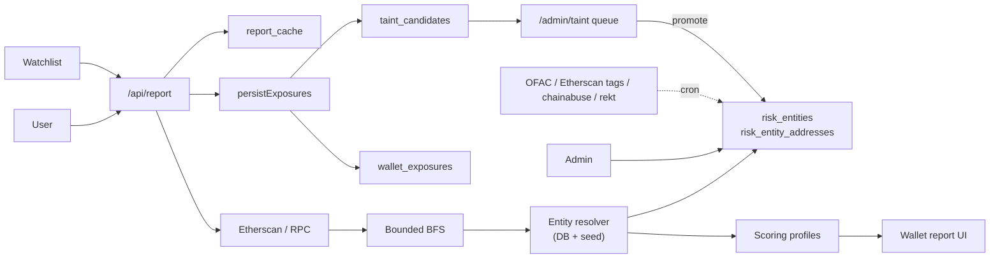
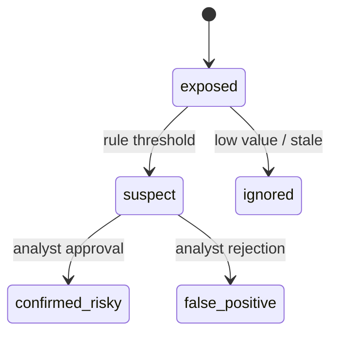

# AML Risk Platform — Roadmap (English)

Operational plan for evolving the current RPC/Etherscan wallet check into a risk intelligence platform: a proprietary directory of risky services, configurable scoring profiles, investigation UI, watchlist/monitoring and tainted-address tracking. Two phases: **MVP (4–6 weeks)** and **Production v1 (10–14 weeks)**.

## At a glance — the questions that matter

| Question | Short answer |
|----------|--------------|
| **Timelines** | The loop **scan → report → directory → exposures** already runs. **Finishing MVP** (investigation UX, scoring polish, ops stability): about **4–6 weeks** with **one** strong full‑stack engineer. **Production v1** (scheduled feeds, taint review in UI, basic alerting): another **10–14 weeks** part‑time; calendar‑wise often **~3–4 months** solo—second engineer on integrations or UI helps most. |
| **Architecture & ownership** | Single repo: Next.js 14 + Supabase (Postgres, Auth). Migrations are the **data contract**; engine behavior in **`ENGINE.md`**, user-facing methodology in **`METHODOLOGY.md`**. No separate architecture org assumed—decisions live in code and docs. |
| **Team** | **Minimum:** one full‑stack engineer (SQL, API, React). **Comfortable:** +1 on feeds/admin or heavy UI. Legal/compliance is **outside** this estimate; without it the product stays an **analytics tool**, not regulatory assurance. |
| **Phases** | **(1) Shipped baseline:** DB directory, resolver, import, admin, reports, watchlist, auto exposure capture. **(2) MVP:** investigation layout, weights closer to DB‑driven config, fewer rough edges. **(3) v1:** **idempotent** external ingest jobs, `/admin/taint`, optional monitoring. |
| **Best way forward** | Do not rewrite the stack. Grow the directory as source of truth; feeds include **lineage** and dedupe on `(entity_id, currency, address)`; promotion from `taint_candidates` stays **human‑in‑the‑loop**—no auto‑accusation of wallets. |
| **Automatic data collection** | **Feasible** for **public** datasets (sanctions files, some community APIs)—parse, normalize, load the catalog. Hard parts: **licenses, rate limits, entity resolution quality**, ongoing maintenance—not missing technology. |
| **Realistic on a shoestring?** | **Yes** as an internal or niche product: wallet checks, curated directory, methodology versioning. **No** for parity with large commercial AML suites (global coverage, legal opinions, 24/7 ops, certifications) without more people and budget. |

**Languages:** [Русский → `ROADMAP.ru.md`](ROADMAP.ru.md) · [Index → `ROADMAP.md`](ROADMAP.md)

Companion docs: [`README.md`](README.md), [`METHODOLOGY.md`](METHODOLOGY.md), [`ENGINE.md`](ENGINE.md) (engine, database and auto-detection in depth).

---

## 1. Vision

- Move from “RPC + a few static lists” to a proprietary risk directory, profile-driven scoring, investigation UI and tainted-address tracking on the existing Next.js 14 + Supabase + Etherscan stack.
- **Exposure ≠ accusation:** addresses connected to risky services live in `wallet_exposures` / `taint_candidates` with a state machine; they are never auto-promoted to “bad.”
- **Reproducibility:** every report records `methodology_version`, `profile_version`, `lists_version_hash`.
- **Continuous DB feed:** the directory is enriched from external feeds and from the internal loop **report → exposure → taint → review → entity.**

---

## 2. Current state

| Area | Status | Notes |
|------|--------|-------|
| Address ingest | Live | Etherscan V2 + Alchemy-style RPC; EVM only (chains 1, 8453) |
| Risk directory | ✅ | DB-backed: `risk_entities`, `risk_entity_addresses`, hierarchical `risk_categories` with rich tag taxonomy |
| Multi-currency addresses | ✅ | `currency` + nullable `chain_id`; non-EVM stored for catalog; scoring still EVM-only until Phase 2 |
| Resolver | ✅ | DB index with TTL + seed fallback; `lists_version_hash` in cache key |
| Scoring | Partial | `engine.ts` + `weights.ts` + default `risk_score_profiles` in DB; weights still mostly in TS |
| Report cache | ✅ | Supabase `report_cache`; `cache_key = address \| methodology \| listsHash \| depth \| fanout` |
| Auto exposure capture | ✅ | `persistExposures` → `wallet_exposures` + `taint_candidates` after each report |
| Auth & admin | ✅ | Supabase Auth, `admin_users`, `/admin/{entities,import,providers,blacklist,audit,users}` |
| Bulk import | ✅ | CSV / JSON blocklist import + `Unattributed · <tag>` bucket for anonymous rows |
| User settings | ✅ | `user_settings` (profile, default chains, notifications) |
| Investigation UI | Partial | Directory, Watchlist, Settings, Profiles; report needs “Investigation” layout |
| Continuous external feeds | ❌ | Seed + manual import only; Phase 2 |
| Taint review queue | ❌ | Candidates accumulate; `confirmed_risky` still manual/SQL; Phase 2 |
| Alerts / monitoring | ❌ | Phase 2 |

---

## 3. Shipped so far

- **Risk directory as source of truth** — migrations `20260506000000`, `…003`: hierarchical categories, `risk_entity_addresses` with `currency`, `owner_label`, `mentions`, `entry_description`; unique `(entity_id, currency, address)`.
- **Rich tag taxonomy** — tags such as `us_ofac_sanctions`, CSAM subtree, `extortion_ransom` variants, `hacking` (Conti, Dharma), `nested_illicit` (Hydra, SUEX), `stolen_coins` variants, `terrorism` variants, scam sub-tags, `abuse_reported` / `illicit_reported` / `user_reported`, `autodetected_alert`, `banned_by_contract`, `pending_review`, `political_organization`, etc.
- **DB-backed resolver** — `ensureLabelIndex()`, `lookupLabelDb()`, `dbIndexSnapshot()`; cache key reflects DB state.
- **Auto exposure capture** — `persistExposures()` after every report.
- **Auth & admin** — `admin_users`, `requireAdmin()`, `/admin/users`; first admin via SQL bootstrap.
- **Tagged bulk import** — `parseImport()` (CSV / JSON); non-EVM currencies supported on ingest.
- **UI** — top nav, Directory (master/detail), Watchlist, Settings, Profiles, Admin suite; light theme.
- **Shared latest reports** — `/api/reports` no longer filters by `expires_at`.
- **Compact analyze landing** — tighter home wallet check UI.
- **Reproducibility** — reports pin `methodologyVersion` + `listsVersion` via `cache_key`.

---

## 4. Target architecture

**Design rules**

- Directory = source of truth; static lists are bootstrap fallback.
- Scoring configuration lives in `risk_score_profiles` (JSON); engine should apply the active profile and pin `profile_version`.
- `RiskDataProvider` stays pluggable for licensed oracles without UI changes.
- Every report pins profile and list versions.
- **Three feed channels:** Phase 2 external cron feeds, manual admin import (today), internal taint→review→promote loop (auto capture today; review UI next).
- Details: [`ENGINE.md`](ENGINE.md).

---

## 5. Phase 1 — MVP (actual status)

| Track | Status | Remaining |
|-------|--------|-----------|
| Risk Directory schema | ✅ | — |
| Entity resolver (DB + seed + TTL) | ✅ | — |
| Scoring profiles | 🟡 | Profile editor UI; engine reads `config.categories` from DB |
| Report redesign (investigation) | 🟡 | Decision header, profile card, direct/indirect exposure, counterparty filters |
| Directory UI | ✅ | Optional: inline edit/archive from Directory |
| Watchlist | ✅ | Background rescan in Phase 2 |
| Tainted tracking | 🟡 | Full `exposure_paths` trace; `/admin/taint` review UI |
| Auth & Admin | ✅ | Separate `analyst` vs `admin` RBAC polish |

---

## 6. Phase 2 — Production v1 (10–14 weeks)

| Track | Scope |
|-------|--------|
| **6.1 Tx store (w7–9)** | `wallet_transactions`, `wallet_counterparties` by `(chain_id, address)`; incremental scans; `scan_jobs` queue. |
| **6.2 External feeds (w8–9)** | Vercel Cron / pg_cron: OFAC SDN daily, Etherscan public tags weekly, chainabuse/scamsniffer daily, rekt/immunefi event-driven; adapters call `/api/admin/import` with service key; `audit_events` + `static_list_versions`. |
| **6.3 Taint review (w10–11)** | `/admin/taint` queue; promote → `risk_entity`; decay + min-amount rules; entity-level dedup; RLS-safe writes. |
| **6.4 Monitoring & alerts (w10–11)** | Scheduled watchlist rescans; alerts on grade change / new direct exposure; `wallet_score_history`; email + webhook. |
| **6.5 Investigation graph (w12–13)** | Visual graph root → counterparties → entities; edge evidence; CSV/ JSON export. |
| **6.6 RBAC + profile editing (w12–13)** | Roles `admin / analyst / viewer`; profile versioning + UI editor; approval flow. |
| **6.7 Hardening (w14)** | Load tests; RLS hardening; metrics (provider errors, latency, cache hit, taint queue depth); RC. |

---

## 7. Continuous data feed

See [`ENGINE.md` §5](ENGINE.md#5-continuous-db-feed--как-держать-базу-живой) for the full narrative.

| Channel | Source | Trigger | Write target | Status |
|---------|--------|---------|--------------|--------|
| Sanctions | OFAC SDN | Daily cron | `risk_entities`, `ofac-sdn` | Planned (6.2) |
| Public tags | Etherscan / BaseScan | Weekly | `pending_review`, `etherscan-public` | Planned (6.2) |
| Community scams | chainabuse, scamsniffer | Daily | `user_reported`, `pending_review` | Planned (6.2) |
| Hacks | rekt.news, immunefi | Event | `hacking` / `stolen_coins` | Planned (6.2) |
| Taint promotion | Analyst review | Continuous | New or extended `risk_entity` | Auto capture ✅; UI planned (6.3) |
| User feedback Report address | Product UI | On demand | `user_reported`, `pending_review` | Planned (6.3) |

**Quality guardrails:** all external loads via `/api/admin/import` → `audit_events`; non-sanction entities can default to `pending_review`; decay job for stale `exposed`; min-amount in profile config; `confirmed_risky` only for `analyst`/`admin`.

---

## 8. Team (minimum viable)

### MVP tail

| Role | Scope | FTE |
|------|-------|-----|
| Tech lead / full-stack | Architecture, data model, scoring, reviews, critical FE | 1.0 |
| Frontend / product engineer | Report, directory, watchlist, admin | 1.0 |
| QA / domain analyst | Tests, taxonomy, regression | 0.5 |

Design: ~0.25 FTE for key screens.

### Production v1

| Role | Scope | FTE |
|------|-------|-----|
| Tech lead | System design, governance, profiles | 1.0 |
| Backend / data engineer | Tx store, feeds, taint jobs | 1.0 |
| Frontend engineer | Graph UI, admin, alerts, profile editor | 1.0 |
| QA / domain analyst | E2E, taxonomy playbooks | 0.75 |

---

## 9. Stages & timeline

### MVP wrap-up (1–2 weeks)

| Week | Deliverable |
|------|-------------|
| MVP+1 | Report “Investigation” layout: decision header, profile card, direct/indirect exposure, counterparty filters |
| MVP+2 | `exposure_paths` tracing; minimal `/admin/taint` queue; profile editor (read/edit JSON) |

### Production v1

| Week | Deliverable |
|------|-------------|
| 7–9 | Tx store + scan jobs + incremental ingest |
| 8–9 | External feed pipeline + audit |
| 10–11 | Taint review + decay/min-amount + monitoring + alerts |
| 12–13 | Graph UI + RBAC + profile versioning + editor |
| 14 | Hardening, load tests, RC |

---

## 10. Practices we borrow

| Practice | Where |
|----------|-------|
| Entity-first directory (industry standard) | Directory schema + UI |
| Multi-asset tagging | Shipped |
| Profile-driven scoring | Phase 1 polish + Phase 2 editor |
| Direction- & hop-aware exposure | Engine + graph |
| State machine for taint | `taint_candidates` |
| Bounded graph expansion | Env caps + Phase 2 jobs |
| Reproducible reports | `cache_key` + version pins |
| External feeds on cron | Phase 2 |
| Public-first, provider-pluggable | `RiskDataProvider` |

---

## 11. Risks

| Risk | Mitigation |
|------|------------|
| Public-only data quality | Show confidence + coverage; hook for paid provider |
| Etherscan / RPC rate limits | Phase 2 background jobs + normalized store |
| Auto-tainting false positives | Keep `exposed`/`suspect` separate from `confirmed_risky`; decay + min-amount |
| Score drift | Pin `profile_version` + `lists_version_hash` |
| Analyst overload | Decay, thresholds, entity-level dedup |
| Feed schema drift | Per-feed adapter → stable import schema; alert on `parse_errors` |

---

## 12. MVP definition of done

An analyst can:

1. ✅ Add a risky entity and addresses (UI or CSV / JSON bulk import).
2. ✅ Run a wallet check and see how entities affected the score.
3. 🟡 Read direct vs indirect exposure with evidence without raw JSON (Investigation layout).
4. 🟡 Browse taint candidates with confidence and path (`/admin/taint` + `exposure_paths`).
5. ✅ Add wallets to a personal watchlist and rescan.
6. ✅ Reproduce past reports using stored versions (`cache_key` + payload).

**Production v1 adds:** external cron feeds, automated rescans, alerts, full taint pipeline, graph UI, RBAC, audit story completion.
