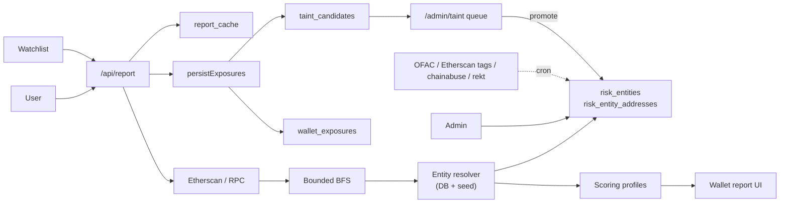
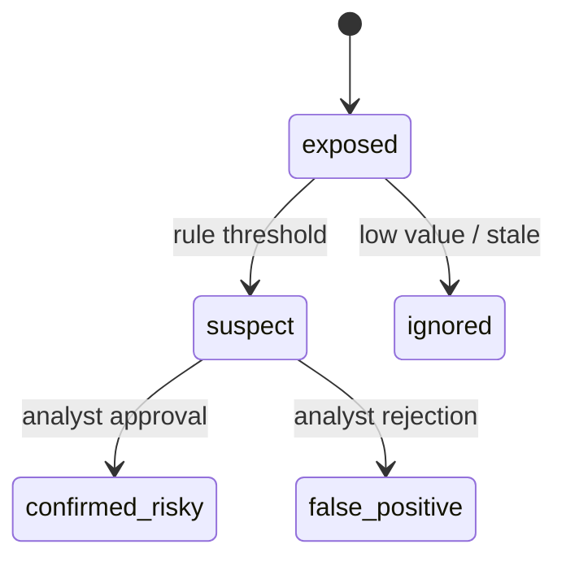

# AML Risk Platform - Roadmap

Operational plan for evolving the current RPC/Etherscan wallet check into a
risk intelligence platform: a proprietary directory of risky services,
configurable scoring profiles, investigation UI, watchlist/monitoring and
tainted-address tracking. Two phases: **MVP (4-6 weeks)** and
**Production v1 (10-14 weeks)**.

Companion docs: [`README.md`](README.md), [`METHODOLOGY.md`](METHODOLOGY.md),
[`ENGINE.md`](ENGINE.md) (полный разбор движка, БД и автодетекции).

> RU: дорожная карта в двух фазах. Цель MVP — заменить тонкую обёртку над
> Etherscan на собственную базу рисковых сущностей с конфигурируемым
> скорингом, отчётом-расследованием и watchlist-ом. Phase 2 — непрерывное
> пополнение каталога (внешние фиды + аналитический pipeline для taint
> кандидатов) и алертинг.

---

## 1. Vision / Видение

| EN | RU |
|----|----|
| Move from "RPC + a few static lists" to a proprietary risk directory, profile-driven scoring, investigation UI and tainted address tracking on the existing Next.js 14 + Supabase + Etherscan stack. | Уйти от связки «RPC + статические списки» к собственному каталогу рисковых сервисов, гибкому скорингу по профилям, UI для расследований и трекингу заражённых адресов на текущем стеке Next.js 14 + Supabase + Etherscan. |
| Exposure ≠ accusation: addresses connected to risky services live in `wallet_exposures` / `taint_candidates` with state machine, never auto-promoted. | Подверженность ≠ обвинение: адреса, связанные с рисковыми сервисами, попадают в `wallet_exposures` / `taint_candidates` с конечным автоматом, а не помечаются «плохими» автоматически. |
| Reproducibility: every report records `methodology_version`, `profile_version`, `lists_version_hash`. | Воспроизводимость: каждый отчёт хранит `methodology_version`, `profile_version`, `lists_version_hash`. |
| Continuous DB feed: каталог автоматически обогащается из внешних фидов и из внутреннего цикла «отчёт → exposure → taint → review → entity». | Каталог постоянно растёт за счёт внешних источников и feedback-петли с пользовательских отчётов. |

---

## 2. Current State / Текущее состояние

| Area | Status | Кратко по-русски |
|------|--------|------------------|
| Address ingest | Etherscan V2 + Alchemy-style RPC fallback, EVM only (chains 1, 8453) | Только EVM, две сети |
| Risk directory | ✅ DB-backed (`risk_entities`, `risk_entity_addresses`, иерархическая `risk_categories` с Crystal-style тегами) | Каталог в БД, теги вложенные |
| Multi-currency adresses | ✅ `currency` + nullable `chain_id` (BTC/TRX/BCH/LTC/SOL/… принимаются на хранение, в скоринге пока EVM) | Не-EVM хранится, в скоринг попадёт в Phase 2 |
| Resolver | ✅ DB-индекс с TTL + fallback на seed-листы; `lists_version_hash` пиннится в кэш-ключ | Резолвер из БД, статика как backup |
| Scoring | `src/lib/scoring/engine.ts` + `weights.ts` + дефолтный `risk_score_profiles` в БД | Профиль один (default), читается, веса в TS |
| Report cache | ✅ `report_cache` в Supabase, `cache_key = address \| methodology \| listsHash \| depth \| fanout` | Воспроизводимость через cache_key |
| Auto exposure capture | ✅ `persistExposures` пишет в `wallet_exposures` + `taint_candidates` (`exposed/suspect`) после каждого отчёта | Авто-сбор кандидатов работает |
| Auth & admin | ✅ Supabase Auth, `admin_users` в БД, `/admin/{entities,import,providers,blacklist,audit,users}` | Логин и админка готовы |
| Bulk import | ✅ Crystal-style CSV/JSON (`address, currency, tag, owner, mentions, description, evidence_url`) с авто-бакетом `Unattributed · <tag>` | Загрузка блок-листа из файла работает |
| User settings | ✅ `user_settings` (active profile, default chains, notifications) | Per-user настройки в БД |
| Investigation UI | Master/detail Directory ✅, Watchlist ✅, Settings ✅, Profiles read-only ✅; Report redesign частично (нужен «Investigation» layout) | UI каркас есть, нужно дожать «расследование» |
| Continuous external feeds | ❌ — пока только seed + ручной импорт | План Phase 2 |
| Taint review queue | ❌ кандидаты копятся, но `confirmed_risky` руками через SQL | План Phase 2 |
| Alerts / monitoring | ❌ | План Phase 2 |

---

## 3. Done so far / Что уже сделано (✅ shipped)

> Сводка по реальным коммитам — отметить, чтобы планирование Phase 2
> опиралось на реальный фундамент, а не на «бумажный» MVP.

- **Risk directory как источник истины**: миграции `20260506000000`,
  `…003` создали `risk_categories` с иерархией и `risk_entity_addresses`
  с `currency / owner_label / mentions / entry_description`. Уник
  `(entity_id, currency, address)` поддерживает мульти-валютную загрузку
  без коллизий.
- **Crystal-style таксономия тегов**: `us_ofac_sanctions`, `csam`,
  `extortion_ransom (master/robbinhood)`, `hacking (conti/dharma)`,
  `nested_illicit (hydra/suex)`, `stolen_coins (exmo/liquid/ronin)`,
  `terrorism (hamas/russian)`, `gainbitcoin_scam`, `plus_token_scam`,
  `abuse_reported / illicit_reported / user_reported`,
  `autodetected_alert`, `banned_by_contract`, `pending_review`,
  `political_organization`, …
- **DB-backed резолвер с warming + TTL**: `ensureLabelIndex()`,
  `lookupLabelDb()`, `dbIndexSnapshot()`. Cache-key инкорпорирует
  DB-state.
- **Авто-захват exposure**: `persistExposures()` пишет
  `wallet_exposures` и поднимает `taint_candidates` после каждого отчёта.
- **Auth + admin без env-переменных**: `admin_users` таблица,
  `requireAdmin()`, `/admin/users` для grant/revoke ролей. Bootstrap —
  одной SQL-вставкой.
- **Bulk import формата Crystal**: `parseImport()` понимает CSV/JSON со
  столбцами Crystal-блок-листа, авто-бакетит анонимные строки в
  `Unattributed · <tag>`, поддерживает не-EVM валюты.
- **UI**: top-nav, master/detail Directory с поиском и фильтрами,
  Watchlist, Settings, Profiles, Admin (entities/import/providers/users/
  blacklist/audit). Theme переехал в light Crystal-стиле.
- **Latest reports общий**: `/api/reports` без фильтра `expires_at`,
  показывается всем — лента не пустеет после TTL.
- **Compact Analyze landing**: главный экран ужат под inline-проверку.
- **Reproducibility**: каждый отчёт пиннит `methodologyVersion` +
  `listsVersion` (через `cache_key`).

---

## 4. Target Architecture / Целевая архитектура

Design rules / Правила:

- Directory = source of truth. Статика — bootstrap fallback.
- Scoring живёт в `risk_score_profiles` (JSON-конфиг). Engine применяет активный профиль и пиннит `profile_version`.
- `RiskDataProvider` остаётся, чтобы подключить платных оракулов без UI-правок.
- Каждый отчёт пиннит версии профиля и списков.
- **Каталог пополняется тремя каналами**: внешние фиды (Phase 2 cron), ручной admin import (есть), внутренний taint→review→promote loop (есть автокапча, нужна review-очередь).
- Полный разбор: см. [`ENGINE.md`](ENGINE.md).

---

## 5. Phase 1 - MVP (статус по факту) / Фаза 1 — MVP

| Track | Статус | Что осталось |
|-------|--------|--------------|
| 4.1 Risk Directory schema | ✅ | — |
| 4.2 Entity resolver (DB + seed + TTL) | ✅ | — |
| 4.3 Scoring profiles | 🟡 read-only из БД, веса в TS | UI редактирования профиля + чтение `config.categories` в engine |
| 4.4 Report redesign (investigation) | 🟡 базовая `report-view` | Decision header, Risk Score Profile card, direct/indirect exposure блоки, counterparties с фильтром |
| 4.5 Directory UI | ✅ master/detail, поиск, sort by `updated_at desc`, admin add/import | Inline edit/archive прямо из Directory |
| 4.6 Watchlist | ✅ per-user CRUD, manual rescan | Background rescan (Phase 2) |
| 4.7 Tainted tracking | 🟡 `wallet_exposures`/`taint_candidates` пишутся автоматом | `exposure_paths` с полным трейсом, review UI |
| 4.8 Auth & Admin | ✅ Supabase Auth, `admin_users`, `/admin/*`, audit log | RBAC `analyst` уровень — отделить от `admin` |

---

## 6. Phase 2 - Production v1 (10-14 weeks) / Фаза 2

| Track | EN | RU |
|-------|----|----|
| 6.1 Tx store (w7-9) | `wallet_transactions`, `wallet_counterparties` keyed by `(chain_id, address)`; incremental scans; `scan_jobs` queue. | Нормализованное хранилище транзакций и инкрементальные сканы. |
| 6.2 External feeds pipeline (w8-9) | Vercel Cron / pg_cron jobs: OFAC SDN daily, Etherscan public tags weekly, chainabuse/scamsniffer daily, rekt/immunefi by event. Все жмут `/api/admin/import` сервис-ключом, дают `audit_events` и пиннят версию в `static_list_versions`. | Внешние фиды на cron, каждый коммит фиксируется в audit. |
| 6.3 Taint review pipeline (w10-11) | `/admin/taint` queue, promote→risk_entity, decay+min-amount правила, dedup на entity-level, RLS-защищённая запись. | Аналитическая очередь и promote-кнопка для taint кандидатов. |
| 6.4 Monitoring & alerts (w10-11) | Scheduled rescan watchlist'а, alerts on grade change / new direct exposure, score history (`wallet_score_history`), email + webhook (≥1.1). | Пересканы и алерты по изменению оценки и новым попаданиям. |
| 6.5 Investigation graph (w12-13) | Visual graph (root → counterparties → entities), evidence on edges, exports CSV/JSON. | Графовое расследование с экспортом. |
| 6.6 RBAC + profile editing (w12-13) | Roles `admin / analyst / viewer`, full audit, profile versioning + UI editor, approval flow. | Роли, версионирование профилей, UI редактирования. |
| 6.7 Hardening (w14) | Load test, RLS lockdown, metrics (provider failures, latency, cache hit, taint queue depth), release candidate. | Нагрузка, метрики, RC. |

---

## 7. Continuous data feed / Непрерывное пополнение базы

Полный разбор — [`ENGINE.md` §5](ENGINE.md#5-continuous-db-feed--как-держать-базу-живой).
Здесь — план в виде задач:

| Канал | Источник | Триггер | Запись | Статус |
|-------|----------|---------|--------|--------|
| Sanctions | OFAC SDN feed | daily 06:00 UTC (Vercel Cron) | `risk_entities (sanctioned)`, `source=ofac-sdn` | планируется (6.2) |
| Public attribution | Etherscan/BaseScan label cloud | weekly | `pending_review`, `source=etherscan-public` | планируется (6.2) |
| Community scam reports | chainabuse, scamsniffer | daily | `category=user_reported`, `pending_review` | планируется (6.2) |
| Hacks / exploits | rekt.news, immunefi | event-driven | `category=hacking / stolen_coins` | планируется (6.2) |
| Internal taint promotion | analyst review of `taint_candidates` | continuous | новый `risk_entity` или дополнение существующего | автокапча ✅ ; review UI планируется (6.3) |
| Customer feedback | "Report this address" из UI | user-driven | `category=user_reported`, `pending_review` | планируется (6.3) |

**Гарантии качества потока**:

- каждое внешнее обновление пишется через `/api/admin/import` →
  `audit_events` хранит «кто, что и сколько добавил»;
- entity всегда стартует со `status=pending_review` (если не sanctioned);
- decay-job (pg_cron) переводит `taint_candidates.exposed` старше N дней
  без новых попаданий в `ignored`;
- min-amount порог настраивается в `risk_score_profiles.config.taint`;
- `confirmed_risky` доступен только пользователю с ролью `analyst`/`admin`.

---

## 8. Team / Команда (минимально достаточная)

### MVP

| Role | EN | RU | FTE |
|------|----|----|-----|
| Tech lead / full-stack | Architecture, data model, scoring, reviews, critical FE bits. | Архитектура, схема БД, скоринг, ревью, критичный frontend. | 1.0 |
| Frontend / product engineer | Report redesign, directory, watchlist, admin UI. | Отчёт, каталог, watchlist, админка. | 1.0 |
| QA / domain analyst | Fixtures, edge cases, taxonomy review, regression. | Тест-кейсы, taxonomy, регрессы. | 0.5 |

> Дизайн привлекаем точечно (0.25 FTE) на ключевые экраны.

### Production v1

| Role | EN | RU | FTE |
|------|----|----|-----|
| Tech lead | System design, governance, profiles. | Системный дизайн, governance. | 1.0 |
| Backend / data engineer | Tx store, external feeds, taint pipeline, jobs. | Хранилище, внешние фиды, taint, фоновые задачи. | 1.0 |
| Frontend engineer | Investigation graph, admin, alerting UI, profile editor. | Граф расследования, админка, алерты, редактор профилей. | 1.0 |
| QA / domain analyst | E2E, taxonomy curation, review playbooks. | E2E, taxonomy, плейбуки. | 0.75 |

---

## 9. Stages & Timeline / Этапы

### MVP — оставшиеся хвосты (1-2 недели)

| Week | Deliverable |
|------|-------------|
| MVP+1 | Report «Investigation» layout: Decision header, profile card, direct vs indirect exposure, counterparties фильтр |
| MVP+2 | `exposure_paths` с трейсом, `/admin/taint` минимальная очередь, profile editor (read+edit JSON config) |

### Production v1

| Week | Deliverable |
|------|-------------|
| 7-9   | Tx store + scan jobs + incremental ingest |
| 8-9   | External feed pipeline (OFAC daily, Etherscan tags, chainabuse, rekt) + audit |
| 10-11 | Taint review pipeline + decay/min-amount + monitoring + alerts |
| 12-13 | Graph UI + RBAC + profile versioning + UI editor |
| 14    | Hardening, load tests, RC |

---

## 10. Best Practices Borrowed / Лучшие практики

| Practice | Where | RU |
|----------|-------|----|
| Entity-first directory (Crystal/Chainalysis/TRM) | 4.1, 4.5 | Каталог сущностей вместо «голых» адресов |
| Crystal-style multi-asset tagging | 3 (shipped) | Один кластер — много валют (BTC/TRX/EVM) |
| Profile-driven scoring | 4.3 | Скоринг по профилю под клиента/регион |
| Direction- & hop-aware exposure | 4.3, 4.4 | Учёт направления и числа хопов |
| State machine for taint | 4.7, 6.3 | Конечный автомат для tainted-адресов |
| Bounded graph expansion | shipped, 6.1 | Жёсткие границы BFS |
| Reproducible reports | shipped (cache_key + version pin) | Версионирование для аудита |
| External feeds on cron | 6.2 | Внешние фиды через scheduled jobs |
| Public-first, provider-pluggable | `RiskDataProvider`, 6.x | Возможность добавить платных провайдеров |

---

## 11. Risks / Риски

| Risk | Mitigation | RU |
|------|------------|----|
| Public-only data quality | Show confidence + source coverage, leave hook for paid provider | Показываем confidence/coverage, оставляем интерфейс под платных |
| Etherscan/RPC rate limits during graph scan | Background jobs in Phase 2, normalized store | Фоновые задачи и хранилище в Phase 2 |
| Auto-tainting → false positives | Keep `exposed/suspect` separate from `confirmed_risky`, decay + min-amount | Отделяем подверженность от обвинения, decay, минимумы |
| Score drift breaks reproducibility | Pin `profile_version` + `lists_version_hash` (shipped) | Пиннинг версий в каждом отчёте |
| Analyst overload | Decay, min-amount, age cutoff, dedup at entity level | Decay, минимумы, дедуп по сущности |
| External feed schema drift | Wrap each feed in adapter that calls `/api/admin/import` with stable schema; alert on parse_errors > 0 | Адаптеры под каждый фид + алерт по `parse_errors` |

---

## 12. Definition of Done / Когда MVP считается готовым

An analyst can / Аналитик может:

1. ✅ Добавить рисковую сущность и её адреса (UI или Crystal-style bulk import).
2. ✅ Проверить кошелёк и увидеть, как сущность повлияла на оценку.
3. 🟡 Прочитать direct vs indirect exposure с evidence без сырого JSON (нужен «investigation» layout).
4. 🟡 Видеть адреса-кандидаты в taint с confidence и путём (есть таблица, нужен `/admin/taint` UI и `exposure_paths`).
5. ✅ Добавить кошелёк в личный watchlist и пересканить.
6. ✅ Воспроизвести любой прошлый отчёт по сохранённым версиям (через `cache_key` + `methodologyVersion` в payload).

В Production v1 дополнительно: внешние фиды на cron, автопересканы,
алерты, taint-pipeline с decay/min-amount, графовый UI, RBAC и audit.
