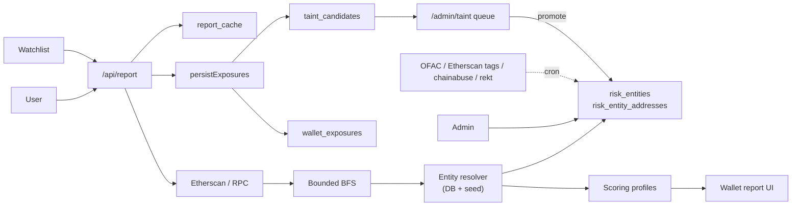
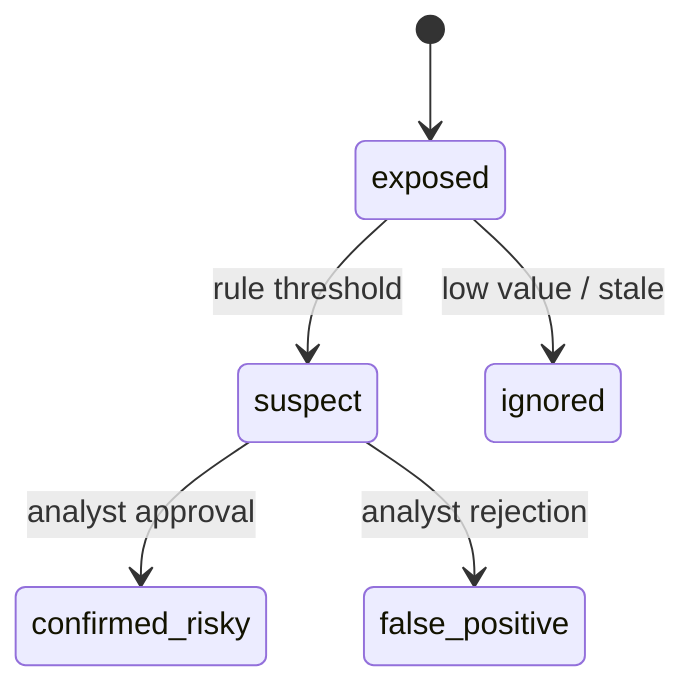

# AML Risk Platform — Дорожная карта (Русский)

План развития текущей проверки кошелька (RPC/Etherscan) до платформы risk intelligence: собственный каталог рисковых сервисов, настраиваемые профили скоринга, UI для расследований, watchlist/monitoring и трекинг «заражённых» адресов. Две фазы: **MVP (4–6 недель)** и **Production v1 (10–14 недель)**.

**Языки:** [English → `ROADMAP.en.md`](ROADMAP.en.md) · [Указатель → `ROADMAP.md`](ROADMAP.md)

Сопутствующие документы: [`README.md`](README.md), [`METHODOLOGY.md`](METHODOLOGY.md), [`ENGINE.md`](ENGINE.md) — подробно про движок, внутреннюю БД и автодетекцию.

---

## 1. Видение

- Уйти от связки «RPC + несколько статических списков» к собственному каталогу рисковых сервисов, скорингу по профилям, UI для расследований и трекингу заражённых адресов на стеке Next.js 14 + Supabase + Etherscan.
- **Подверженность ≠ обвинение:** адреса, связанные с рисковыми сервисами, попадают в `wallet_exposures` / `taint_candidates` с конечным автоматом и не помечаются «плохими» автоматически.
- **Воспроизводимость:** каждый отчёт фиксирует `methodology_version`, `profile_version`, `lists_version_hash`.
- **Непрерывное пополнение БД:** каталог обогащается внешними фидами и внутренним циклом **отчёт → exposure → taint → review → entity.**

---

## 2. Текущее состояние

| Область | Статус | Кратко |
|---------|--------|--------|
| Загрузка ончейна | Есть | Etherscan V2 + Alchemy-style RPC; только EVM, сети 1 и 8453 |
| Risk directory | ✅ | БД: `risk_entities`, `risk_entity_addresses`, иерархия `risk_categories` с расширенной таксономией тегов |
| Мульти-валюта | ✅ | `currency` + nullable `chain_id`; не-EVM хранится в каталоге; в скоринг пока только EVM (Phase 2) |
| Резолвер | ✅ | Индекс из БД с TTL + fallback на seed; `lists_version_hash` в ключе кэша |
| Скоринг | Частично | `engine.ts` + `weights.ts` + дефолтный `risk_score_profiles` в БД; веса в основном в TS |
| Кэш отчётов | ✅ | `report_cache`; ключ `address \| methodology \| listsHash \| depth \| fanout` |
| Авто exposure | ✅ | `persistExposures` → `wallet_exposures` + `taint_candidates` после каждого отчёта |
| Auth и админка | ✅ | Supabase Auth, `admin_users`, `/admin/{entities,import,providers,blacklist,audit,users}` |
| Массовый импорт | ✅ | CSV/JSON блок-листа + бакет `Unattributed · <tag>` |
| Настройки пользователя | ✅ | `user_settings` (профиль, сети, уведомления) |
| UI расследования | Частично | Directory, Watchlist, Settings, Profiles; отчёту нужен layout «расследование» |
| Внешние фиды | ❌ | Пока seed + ручной импорт; Phase 2 |
| Очередь review taint | ❌ | Кандидаты копятся; `confirmed_risky` вручную/SQL; Phase 2 |
| Алерты / мониторинг | ❌ | Phase 2 |

---

## 3. Уже сделано (shipped)

- **Каталог как источник истины** — миграции `20260506000000`, `…003`: иерархия категорий, `risk_entity_addresses` с `currency`, `owner_label`, `mentions`, `entry_description`; уникальность `(entity_id, currency, address)`.
- **Расширенная таксономия тегов** — `us_ofac_sanctions`, ветка CSAM, `extortion_ransom` (варианты), `hacking` (Conti, Dharma), `nested_illicit` (Hydra, SUEX), варианты `stolen_coins`, `terrorism`, под-теги scam, `abuse_reported` / `illicit_reported` / `user_reported`, `autodetected_alert`, `banned_by_contract`, `pending_review`, `political_organization` и др.
- **Резолвер из БД** — `ensureLabelIndex()`, `lookupLabelDb()`, `dbIndexSnapshot()`; cache-key учитывает состояние БД.
- **Автозахват exposure** — `persistExposures()` после каждого отчёта.
- **Админка без env для ролей** — `admin_users`, `requireAdmin()`, `/admin/users`; первый админ — SQL bootstrap.
- **Bulk import (CSV / JSON)** — `parseImport()`; поддержка не-EVM валют на приёме данных.
- **UI** — верхняя навигация, Directory (master/detail), Watchlist, Settings, Profiles, админ-модули; светлая тема.
- **Общая лента последних отчётов** — `/api/reports` без фильтра по `expires_at`.
- **Компактный экран Analyze** — ужатый главный экран проверки.
- **Воспроизводимость** — отчёты пиннят `methodologyVersion` + `listsVersion` через `cache_key`.

---

## 4. Целевая архитектура

**Правила проектирования**

- Каталог = источник истины; статика = bootstrap fallback.
- Конфиг скоринга в `risk_score_profiles` (JSON); движок дожжен применять активный профиль и пиннить `profile_version`.
- `RiskDataProvider` остаётся для платных оракулов без перелопачивания UI.
- Каждый отчёт пиннит версии профиля и списков.
- **Три канала пополнения:** внешние cron-фиды (Phase 2), ручной импорт админки (уже есть), цикл taint→review→promote (автозахват есть, очередь review — дальше).
- Подробно: [`ENGINE.md`](ENGINE.md).

---

## 5. Фаза 1 — MVP (фактический статус)

| Трек | Статус | Осталось |
|------|--------|----------|
| Схема Risk Directory | ✅ | — |
| Резолвер сущностей | ✅ | — |
| Профили скоринга | 🟡 | UI редактора; чтение `config.categories` из БД в engine |
| Переразметка отчёта | 🟡 | Decision header, карточка профиля, direct/indirect exposure, фильтр контрагентов |
| Directory UI | ✅ | По желанию: inline edit/archive из Directory |
| Watchlist | ✅ | Фоновые пересканы в Phase 2 |
| Taint | 🟡 | Полный трейс в `exposure_paths`; UI `/admin/taint` |
| Auth & Admin | ✅ | Развести `analyst` и `admin` в RBAC |

---

## 6. Фаза 2 — Production v1 (10–14 недель)

| Трек | Содержание |
|------|------------|
| **6.1 Хранилище транзакций (нед. 7–9)** | `wallet_transactions`, `wallet_counterparties` по `(chain_id, address)`; инкрементальные сканы; очередь `scan_jobs`. |
| **6.2 Внешние фиды (нед. 8–9)** | Vercel Cron / pg_cron: OFAC SDN ежедневно, публичные теги Etherscan еженедельно, chainabuse/scamsniffer ежедневно, rekt/immunefi по событиям; адаптеры бьют в `/api/admin/import`; `audit_events` + `static_list_versions`. |
| **6.3 Review taint (нед. 10–11)** | Очередь `/admin/taint`; promote → `risk_entity`; decay + min-amount; дедуп на уровне сущности; запись с учётом RLS. |
| **6.4 Мониторинг и алерты (нед. 10–11)** | Плановые пересканы watchlist; алерты при смене грейда / новом direct exposure; `wallet_score_history`; email + webhook. |
| **6.5 Граф расследования (нед. 12–13)** | Визуальный граф root → контрагенты → сущности; evidence на рёбрах; экспорт CSV/JSON. |
| **6.6 RBAC + редактор профилей (нед. 12–13)** | Роли `admin / analyst / viewer`; версионирование профилей + UI-редактор; approval flow. |
| **6.7 Закалка (нед. 14)** | Нагрузочные тесты; ужесточение RLS; метрики (ошибки провайдеров, latency, cache hit, глубина очереди taint); RC. |

---

## 7. Непрерывное пополнение базы

Полный разбор — [`ENGINE.md` §5](ENGINE.md#5-continuous-db-feed--как-держать-базу-живой).

| Канал | Источник | Триггер | Куда пишем | Статус |
|-------|----------|---------|------------|--------|
| Санкции | OFAC SDN | Ежедневно cron | `risk_entities`, `ofac-sdn` | План (6.2) |
| Публичные теги | Etherscan / BaseScan | Еженедельно | `pending_review`, `etherscan-public` | План (6.2) |
| Скам-репорты | chainabuse, scamsniffer | Ежедневно | `user_reported`, `pending_review` | План (6.2) |
| Взломы | rekt.news, immunefi | По событию | `hacking` / `stolen_coins` | План (6.2) |
| Promote из taint | Review аналитика | Постоянно | Новая или расширенная `risk_entity` | Автозахват ✅; UI план (6.3) |
| «Сообщить об адресе» из UI | Продукт | По запросу юзера | `user_reported`, `pending_review` | План (6.3) |

**Качество потока:** внешние загрузки через `/api/admin/import` → `audit_events`; не-санкционные сущности могут стартовать с `pending_review`; decay для устаревших `exposed`; min-amount в конфиге профиля; `confirmed_risky` только у `analyst`/`admin`.

---

## 8. Команда (минимум)

### Хвост MVP

| Роль | Зона | FTE |
|------|------|-----|
| Tech lead / full-stack | Архитектура, схема БД, скоринг, ревью, критичный FE | 1.0 |
| Frontend / product | Отчёт, каталог, watchlist, админка | 1.0 |
| QA / предметный аналитик | Тесты, taxonomy, регрессии | 0.5 |

Дизайн точечно ~0.25 FTE на ключевые экраны.

### Production v1

| Роль | Зона | FTE |
|------|------|-----|
| Tech lead | Системный дизайн, governance, профили | 1.0 |
| Backend / data | Хранилище транзакций, фиды, taint, джобы | 1.0 |
| Frontend | Граф, админка, алерты, редактор профилей | 1.0 |
| QA / предметный аналитик | E2E, taxonomy, плейбуки | 0.75 |

---

## 9. Этапы и сроки

### Дожим MVP (1–2 недели)

| Неделя | Результат |
|--------|-----------|
| MVP+1 | Layout «расследование» в отчёте: decision header, карточка профиля, direct/indirect exposure, фильтр контрагентов |
| MVP+2 | Трейс в `exposure_paths`; минимальная очередь `/admin/taint`; редактор профиля (чтение/редактирование JSON) |

### Production v1

| Недели | Результат |
|--------|-----------|
| 7–9 | Tx store + scan jobs + инкрементальный ingest |
| 8–9 | Пайплайн внешних фидов + audit |
| 10–11 | Taint review + decay/min-amount + мониторинг + алерты |
| 12–13 | Граф UI + RBAC + версии профилей + редактор |
| 14 | Нагрузка, тесты, RC |

---

## 10. Заимствованные практики

| Практика | Где |
|----------|-----|
| Каталог сущностей (индустриальный стандарт) | Схема + UI |
| Мульти-активные теги | Уже в проде |
| Скоринг по профилю | Дожим Phase 1 + Phase 2 |
| Учёт направления и хопов | Движок + граф |
| Конечный автомат для taint | `taint_candidates` |
| Ограниченный BFS | Env + Phase 2 джобы |
| Воспроизводимые отчёты | `cache_key` + версии |
| Внешние фиды по cron | Phase 2 |
| Публичные данные + платный провайдер | `RiskDataProvider` |

---

## 11. Риски

| Риск | Смягчение |
|------|------------|
| Качество только публичных данных | Confidence + coverage; хук под платного провайдера |
| Лимиты Etherscan/RPC | Phase 2: фоновые задачи + нормализованное хранилище |
| Ложные срабатывания авто-taint | Разделять `exposed`/`suspect` и `confirmed_risky`; decay + min-amount |
| Дрейф скоринга | Пиннинг `profile_version` + `lists_version_hash` |
| Перегруз аналитиков | Decay, пороги, дедуп по сущности |
| Дрейф схемы фида | Адаптер на стабильную схему импорта; алерт по `parse_errors` |

---

## 12. Критерий готовности MVP

Аналитик может:

1. ✅ Добавить рисковую сущность и адреса (UI или CSV / JSON bulk import).
2. ✅ Проверить кошелёк и увидеть влияние сущностей на оценку.
3. 🟡 Читать direct vs indirect exposure с evidence без сырого JSON (нужен layout расследования).
4. 🟡 Видеть кандидатов taint с confidence и путём (нужны `/admin-taint` UI и `exposure_paths`).
5. ✅ Добавить кошелёк в личный watchlist и пересканить.
6. ✅ Воспроизвести прошлый отчёт по сохранённым версиям (`cache_key` + payload).

**В Production v1 дополнительно:** внешние фиды по cron, автопересканы, алерты, полный taint-пайплайн, графовый UI, RBAC, полный audit story.
